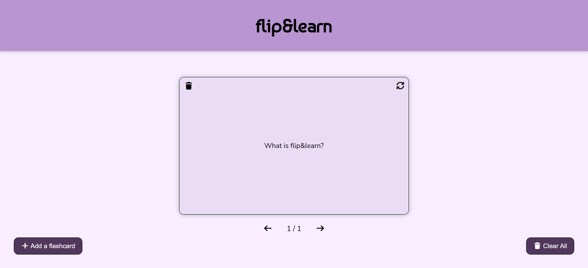

# flip&learn - Flashcards app
A simple, interactive flashcards application. Users can create, flip, navigate, and delete flashcards.

### Features
- Add flashcards - input your own question & answer.
- Flip animation - click to reveal the answer with a smooth 3D flip effect.
- Navigation - browse through cards with previous/next buttons.
- Delete individual cards - remove specific cards anytime.
- Clear all - reset the entire set of flashcards.
- Persistent storage - cards are saved in the browser's localStorage.

### Technologies
- **HTML5** - structure.
- **CSS3** - styling, flexbox, animations.
- **JavaScript** - Logic & localStorage.
- **Font Awesome** - icons.

## Installation guide
1. Download or clone this repository: ``git clone https://github.com/dianabali/flashcards-app.git``
2. Open ``index.html`` in your browser.

## Image

